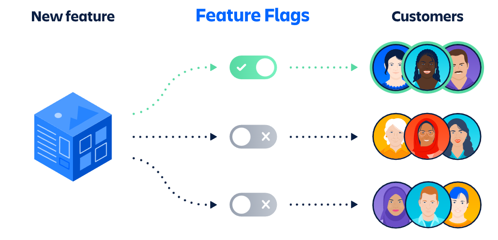
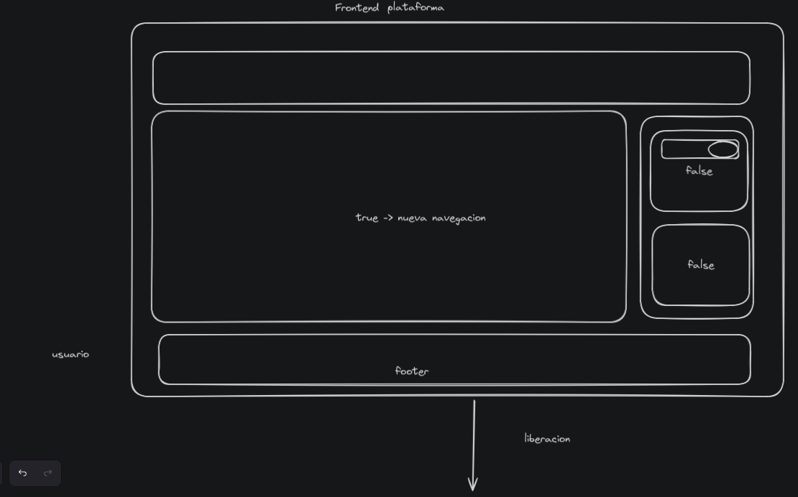

# Feature Flags React App

## Descripción

Esta es una aplicación React simple que utiliza feature flags para habilitar o deshabilitar características específicas en la aplicación. Los feature flags se definen en un archivo de configuración y se utilizan en los componentes para mostrar u ocultar funcionalidades según sea necesario.

## Instalación

1. **Clona el repositorio**
    git clone git@github.com:gacodev/feature_flags.git
2. **Instala las dependencias**
    npm install
3. **Ejecuta la aplicacion**
    npm run dev
4. **Parametriza**
    cambia los valores del archivo src/featureFlags.js de true a false

